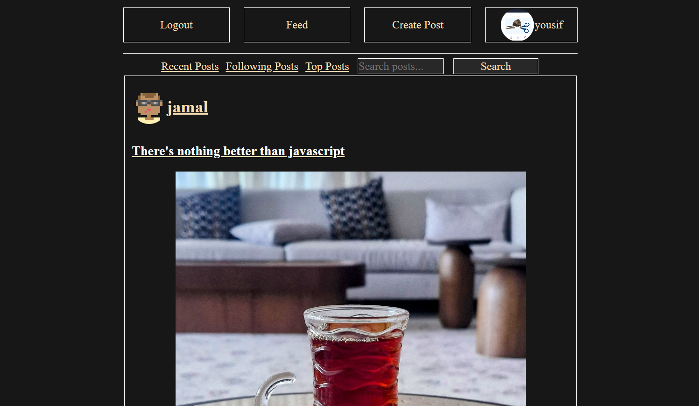

[![Contributors][contributors-shield]][contributors-url]
[![Forks][forks-shield]][forks-url]
[![Stargazers][stars-shield]][stars-url]
[![Issues][issues-shield]][issues-url]
[![project_license][license-shield]][license-url]


<!-- PROJECT LOGO -->
<br />
<div align="center">
  <a href="https://github.com/yousifj129/bluetweet">
    
  </a>

<h3 align="center">BlueTweet</h3>

  <p align="center">
    <br />
    <a href="https://github.com/yousifj129/bluetweet">View Demo</a>
    &middot;
    <a href="https://github.com/yousifj129/bluetweet/issues/new?labels=bug&template=bug-report---.md">Report Bug</a>
    &middot;
    <a href="https://github.com/yousifj129/bluetweet/issues/new?labels=enhancement&template=feature-request---.md">Request Feature</a>
  </p>
</div>


<!-- TABLE OF CONTENTS -->
<details>
  <summary>Table of Contents</summary>
  <ol>
    <li>
      <a href="#about-the-project">About The Project</a>
      <ul>
        <li><a href="#built-with">Built With</a></li>
      </ul>
    </li>
    <li>
      <a href="#getting-started">Getting Started</a>
    </li>
    <li><a href="#roadmap">Roadmap</a></li>
    <li><a href="#contributing">Contributing</a></li>
    <li><a href="#license">License</a></li>
    <li><a href="#contact">Contact</a></li>
    <li><a href="#acknowledgments">Acknowledgments</a></li>
  </ol>
</details>


<!-- ABOUT THE PROJECT -->
## About The Project
This is a twitter inspired social media application. 


<p align="right">(<a href="#readme-top">back to top</a>)</p>


### Built With

* HTML
* Javascript
* CSS
* MongoDB
* EJS
* Node.js


<p align="right">(<a href="#readme-top">back to top</a>)</p>


<!-- GETTING STARTED -->
## Getting Started

Fork this repository and run the game, and follow these steps:
- install the packages: ```npm install```
- add the .env file and write this with your details:
```
MONGODB_URI=you can get it from your database
PORT= probably 3000
SESSION_SECRET= anything random but should stay a secret
CLOUDNAME= cloudinary name
APIKEY= cloudinary api key
APISECRET= cloudinary api secret
```


<!-- ROADMAP -->
## Roadmap

- [x] Ability to create accounts and login and update profile pictures and description.
- [x] Ability to post text and images if needed.
- [x] Ability to comment on a post and like or dislike a post.
- [x] Ability to follow other users and see their content on the "following" feed page
- [x] Ability to search for posts


<p align="right">(<a href="#readme-top">back to top</a>)</p>


<!-- CONTRIBUTING -->
## Contributing

Contributions are what make the open source community such an amazing place to learn, inspire, and create. Any contributions you make are **greatly appreciated**.

1. Fork the Project
2. Create your Feature Branch (`git checkout -b feature/AmazingFeature`)
3. Commit your Changes (`git commit -m 'Add some AmazingFeature'`)
4. Push to the Branch (`git push origin feature/AmazingFeature`)
5. Open a Pull Request

<p align="right">(<a href="#readme-top">back to top</a>)</p>

### Top contributors:

<a href="https://github.com/yousifj129/bluetweet/graphs/contributors">
  
</a>


<!-- LICENSE -->
## License

Distributed under the project_license. See `LICENSE.txt` for more information.

<p align="right">(<a href="#readme-top">back to top</a>)</p>


<!-- CONTACT -->
## Contact

Project Link: [https://github.com/yousifj129/bluetweet](https://github.com/yousifj129/bluetweet)

<p align="right">(<a href="#readme-top">back to top</a>)</p>


<!-- ACKNOWLEDGMENTS -->
## Attributions

* Source of logo: ChatGPT


<p align="right">(<a href="#readme-top">back to top</a>)</p>


## Next Step

* making different levels and different obstacles
* using the canvas tag
* adding best score for infinite mode and saving it in local storage

<!-- MARKDOWN LINKS & IMAGES -->
<!-- https://www.markdownguide.org/basic-syntax/#reference-style-links -->
[contributors-shield]: https://img.shields.io/github/contributors/yousifj129/bluetweet.svg?style=for-the-badge
[contributors-url]: https://github.com/yousifj129/bluetweet/graphs/contributors
[forks-shield]: https://img.shields.io/github/forks/yousifj129/bluetweet.svg?style=for-the-badge
[forks-url]: https://github.com/yousifj129/bluetweet/network/members
[stars-shield]: https://img.shields.io/github/stars/yousifj129/bluetweet.svg?style=for-the-badge
[stars-url]: https://github.com/yousifj129/bluetweet/stargazers
[issues-shield]: https://img.shields.io/github/issues/yousifj129/bluetweet.svg?style=for-the-badge
[issues-url]: https://github.com/yousifj129/bluetweet/issues
[license-shield]: https://img.shields.io/github/license/yousifj129/bluetweet.svg?style=for-the-badge
[license-url]: https://github.com/yousifj129/bluetweet/blob/master/LICENSE.txt
[product-screenshot]: ./Assets/Screenshot.png
[html-url]: 
